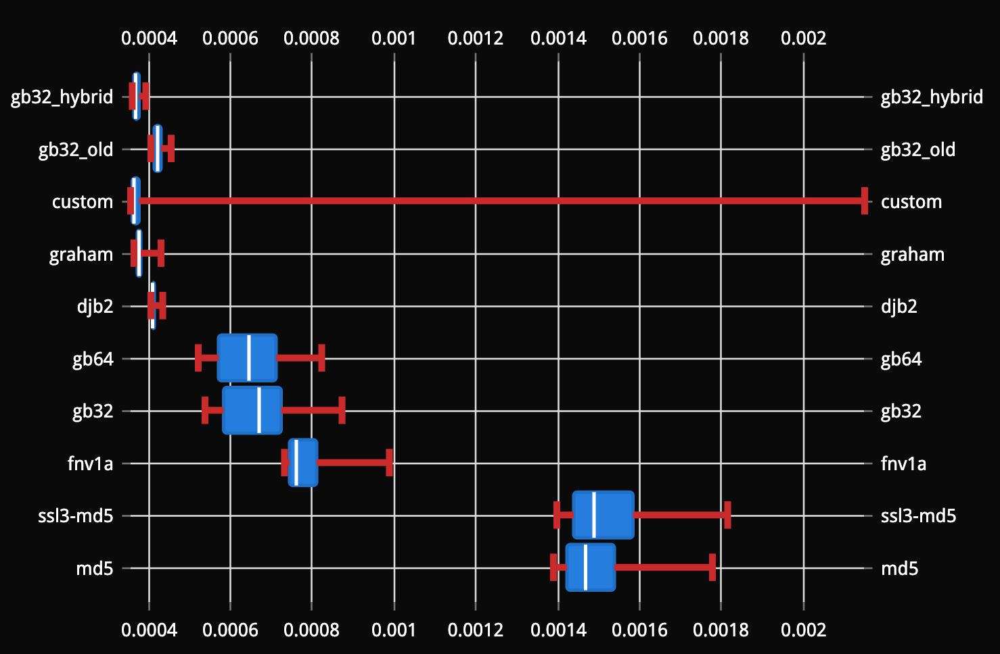
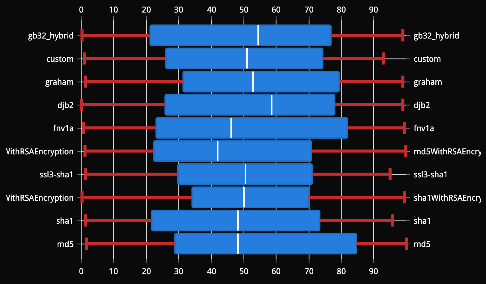
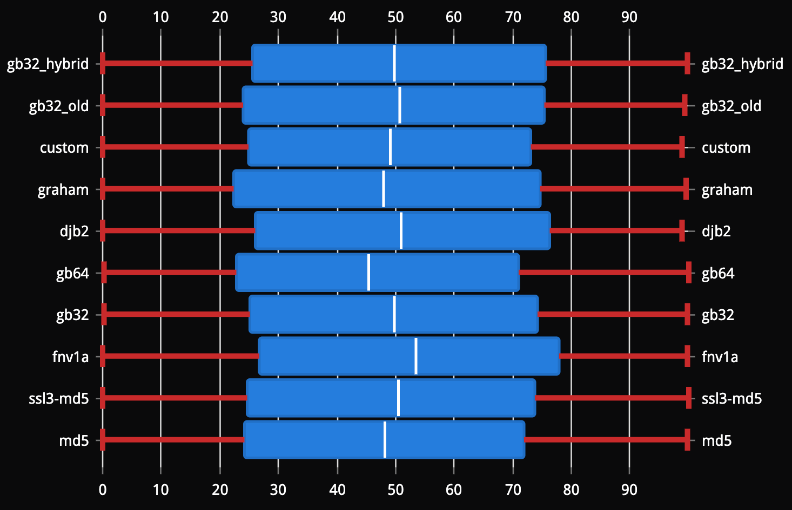
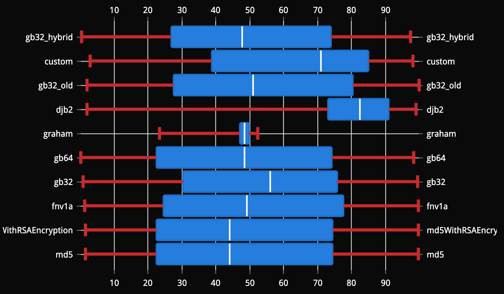
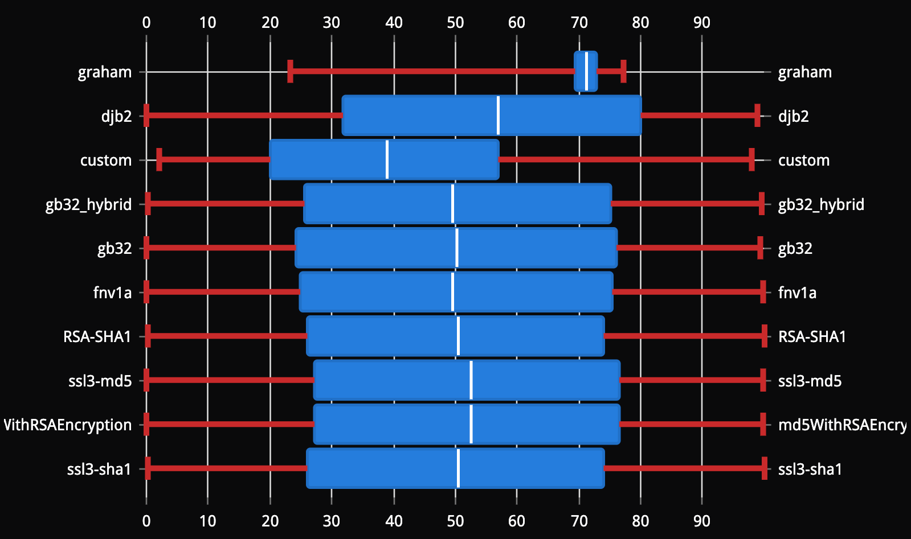
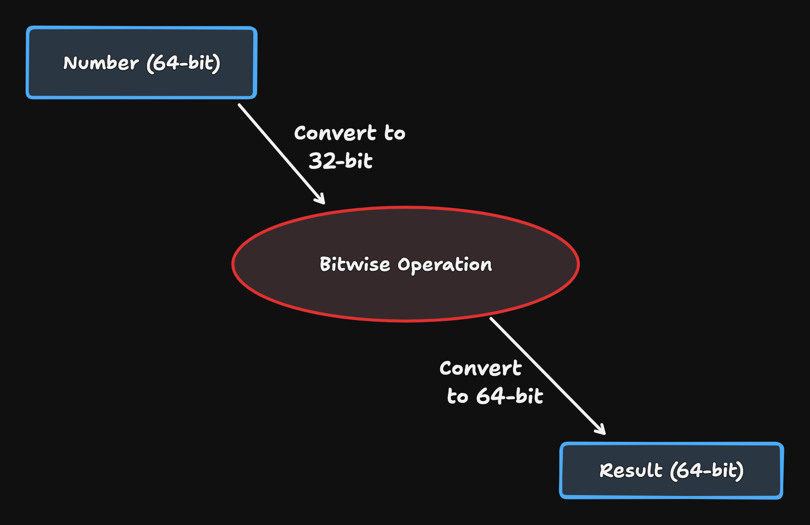

---
# You can also start simply with 'default'
theme: ./theme
# random image from a curated Unsplash collection by Anthony
# like them? see https://unsplash.com/collections/94734566/slidev
background: /images/shakespeare.jpg
# some information about your slides (markdown enabled)
title: What's in a Hash?
info: |
  Would a Gradual Rollout by Any Other Hashing Algorithm Still Smell as Sweet?
# apply unocss classes to the current slide
class: text-left
# https://sli.dev/features/drawing
drawings:
  persist: false
# slide transition: https://sli.dev/guide/animations.html#slide-transitions
transition: slide-left
# enable MDC Syntax: https://sli.dev/features/mdc
mdc: true
# take snapshot for each slide in the overview
overviewSnapshots: true
---

<div class="bg-[#0008] rounded-lg p-8">

# What's in a Hash?

Would a Gradual Rollout by Any Other Hashing Algorithm Still Smell as Sweet?

</div>

---
layout: image-right
image: /images/self-portrait.jpg
---

# Introduction

- cmgriffing on all socials


- Software Dev for ~10 years
- Developer Advocate at GitKraken
- Twitch Programming Streamer
- Snowboarder

---
layout: image-left
image: ./images/vexilla.png
---

# Vexilla

- Started 2022
- Built on stream
- Experimental
- Static-file based
  - cheap
  - scalable
  - fast
- Git-native
  - Simple auditability
  - Easy CI/CD for deployment

---
layout: image-right
image: ./images/subset.png
---

# What is a Gradual Release?

Reproducible releases to a subset of users

- Uses hashing of some static value (eg: User ID)
- Consistently hashes to same subset of users
- Building block to A/B Testing
- Similar to Canary Releases and Blue/Green Deployments
  - Runtime vs Build-time

---
layout: two-cols-header
---

# Why a Custom Algorithm?

::left::

- Portability
  - Same results on all SDKs
  - Easy to write from scratch in unsupported languages

::right::

- Performance?
  - *Untested Assumption

::bottom::

<div class="mt-40"></div>

---

# How My Original Algorithm Worked

```ts
export function hashString(stringToHash: string, seed: number) {
  const characters = stringToHash.split("") as any[];

  let hashValue = 0;
  const length = characters.length;

  for (let i = 0; i < length; i++) {
    hashValue += characters[i].charCodeAt(0);
  }

  return (Math.floor(hashValue * seed * 42) % 100) / 100;
}
```

---

# Graham Hash (Minecraft?)

```ts
export function grahamHash(stringToHash: string, seed: number) {
  const characters = stringToHash.split("") as any[];

  let hashValue = 0;
  const length = characters.length;

  for (let i = 0; i < length; i++) {
    hashValue += characters[i].charCodeAt(0);
  }

  const magicResult = ((hashValue * 9301 + 49297) * seed) % 233280;
  return magicResult / 233280;
}
```

---

# FNV-1a

```ts
const FNV32_OFFSET_BASIS = 2166136261;
const FNV32_PRIME = 16777619;

export function fnv1a(stringToHash: string, seed: number) {
  const byteArray = utf8EncodeText.encode(stringToHash);

  let total = FNV32_OFFSET_BASIS;
  const length = byteArray.length;

  for (let i = 0; i < length; i++) {
    const byte = byteArray[i];
    total = total ^ byte;
    total = total * FNV32_PRIME;
  }

  const result = ((total * seed) % 100) / 100;
  return Math.abs(result);
}
```

---

# DJB2

```ts
export function djb2(stringToHash: string, seed: number) {
  const characters = stringToHash.split("") as any[];
  let hashValue = 5381;
  const length = characters.length;

  for (let i = 0; i < length; i++) {
    hashValue = (hashValue << 5) + hashValue + characters[i].charCodeAt(0);
  }

  return Math.abs((Math.floor(hashValue * seed) % 100) / 100);
}
```

---

# Node.js Native

MD5, SHA, etc (52 in total)

```ts
import { createHash, getHashes } from "crypto";

function createNodeHashFunction(algorithm: string) {
  return {
    algorithm,
    hash: function (content: string) {
      const hashResult = createHash(algorithm).update(content).digest("hex");
      const digestedBigInt = BigInt(`0x${hashResult}`);
      const moduloedInt = digestedBigInt % 4096n;
      const parsedInt = Number(moduloedInt);
      const result = parsedInt / 4096;
      return result;
    },
  };
}

```

---
layout: two-cols-header
---

# Comparing Algorithms

::left::

Speed


::right::

Distribution


::bottom::

<div class="mt-32"></div>

---

# Speed (1000 iterations)

Only graphing the 5% to 95% distribution

The fastest algorithms also had some of the slowest outliers



---

# Distribution - Strings (100 iterations)



---

# Distribution - Strings (1000 iterations)



---

# Distribution - Numbers (100 iterations)



---

# Distribution - Numbers (1000 iterations)



---

# A Hiccup - Inconsistent Results Between JS and Go

JS does some shenanigans with bitwise operations




---

# Growthbook didn't have this problem

```ts
function hashFnv32a(str: string): number {
  let hval = 0x811c9dc5;
  const l = str.length;

  for (let i = 0; i < l; i++) {
    hval ^= str.charCodeAt(i);
    hval +=
      (hval << 1) + (hval << 4) + (hval << 7) + (hval << 8) + (hval << 24);
  }
  return hval >>> 0;
}
```

---

# My final algorithm

```ts
// From GrowthBook
export function hash(
  seed: string,
  value: string,
  version: number
): number | null {
  // ...
  return (hashFnv32a(hashFnv32a(seed + value) + "") % 10000) / 10000;
  // ...
}
```

```ts
// The hybrid function from our graphs earlier
export function hashGB_hybrid(value: string, seed: number): number {
  return ((hashFnv32a(value) * seed) % 1000) / 1000;
}
```

---

# Thanks
